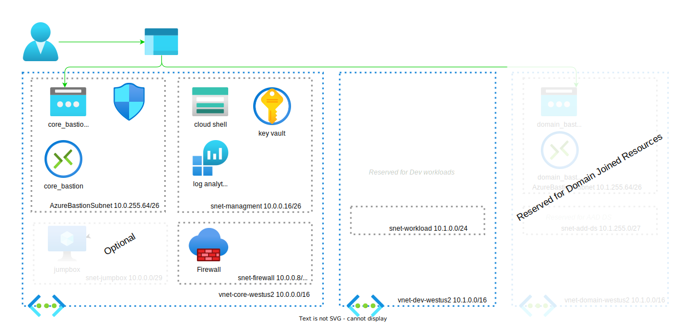

# Azure Subscription Boilerplate

Example project to setup a new azure subscription for development. This project demonstrates several technologies:

* Infrastructure as Code
* Infrastructure Automation
* Management and Landing Zone organization

Network Overview



# Prerequisites

Prerequisites:
- Azure CLI
- Azure Subscription
- GitHub Account

## Install Azure CLI

```bash
# Check if installed
az --version

sudo apt-get update
sudo apt-get install ca-certificates curl apt-transport-https lsb-release gnupg
curl -sL https://packages.microsoft.com/keys/microsoft.asc | gpg --dearmor | sudo tee /etc/apt/trusted.gpg.d/microsoft.gpg > /dev/null

AZ_REPO=$(lsb_release -cs) 
echo "deb [arch=amd64] https://packages.microsoft.com/repos/azure-cli/ $AZ_REPO main" |  sudo tee /etc/apt/sources.list.d/azure-cli.list

sudo apt-get update
sudo apt-get install azure-cli

az --version
```

# Quick Start

Get started creating a new subscription.

* Clone this project and Create a local.env
* Configure GitHub

## Clone Project

```bash
# clone project
git clone https://github.com/briglx/azure_subscription_boilerplate.git

# Navigate to Recipes
cd azure_subscription_boilerplate

# Set Secrets in .env
AZURE_TENANT_ID=ReplaceWithYourTenantId
AZURE_SUBSCRIPTION_ID=ReplaceWithYourSubscriptionId
GITHUB_ORG=ReplaceWithYourGitHubOrgOrUserName
GITHUB_REPO=RepalceWithYourRepoName

cp example.env .env
sed -i "s/<tenant_id>/$AZURE_TENANT_ID/" .env
sed -i "s/<subscription_id>/$AZURE_SUBSCRIPTION_ID/" .env
sed -i "s/<github_org>/$GITHUB_ORG/" .env
sed -i "s/<github_repo>/$GITHUB_REPO/" .env
```

## Configure GitHub

Create An Azure Active Directory application, with a service principal that has contributor access to your subscription. The application uses OpenId Connect (OIDC) based Federated Identity Credentials.


```bash
# load .env vars (optional)
app_name=github_cicd_service_app
app_secret_name=github_cicd_client_secret

az login --tenant $AZURE_TENANT_ID

# Create an Azure Active Directory application and a service principal.
app_id=$(az ad app create --display-name $app_name --query id -o tsv)
app_client_id=$(az ad app list --display-name $app_name --query [].appId -o tsv)
# Save app_id to .env APP_CLIENT_ID
echo AZURE_CLIENT_ID=$app_client_id >> .env
az ad sp create --id $app_id

# Assign contributor role to the app service principal
app_sp_id=$(az ad sp list --all --display-name $app_name --query "[].id" -o tsv)
az role assignment create --assignee $app_sp_id --role contributor --scope /subscriptions/$AZURE_SUBSCRIPTION_ID
az role assignment create --role contributor --subscription $AZURE_SUBSCRIPTION_ID --assignee-object-id  $app_sp_id --assignee-principal-type ServicePrincipal --scope /subscriptions/$AZURE_SUBSCRIPTION_ID

# Add OIDC federated credentials for the application.
post_body="{\"name\":\"$app_secret_name\","
post_body=$post_body'"issuer":"https://token.actions.githubusercontent.com",'
post_body=$post_body"\"subject\":\"repo:$GITHUB_ORG/$GITHUB_REPO:ref:refs/heads/main\","
post_body=$post_body'"description":"GitHub CICID Service","audiences":["api://AzureADTokenExchange"]}' 
az rest --method POST --uri "https://graph.microsoft.com/beta/applications/$app_id/federatedIdentityCredentials" --body "$post_body"

```

Create GitHub secrets for storing Azure configuration.

- Open your GitHub repository and go to Settings.
- Select Secrets and then New Secret.
- Create secrets for `AZURE_CLIENT_ID`, `AZURE_TENANT_ID`, and `AZURE_SUBSCRIPTION_ID` from values in .env

# References

- Use Gitub Actions to connect to Azure https://learn.microsoft.com/en-us/azure/developer/github/connect-from-azure?tabs=azure-portal%2Cwindows
- OpenID Connnect Auth for GitHub https://github.com/Azure/login#configure-a-service-principal-with-a-federated-credential-to-use-oidc-based-authentication
- CAF Migration Landing Zone - https://github.com/microsoft/CloudAdoptionFramework/tree/master/ready/migration-landing-zone-governance
- Azure Security Benchmark https://learn.microsoft.com/en-us/azure/governance/blueprints/samples/azure-security-benchmark-foundation/